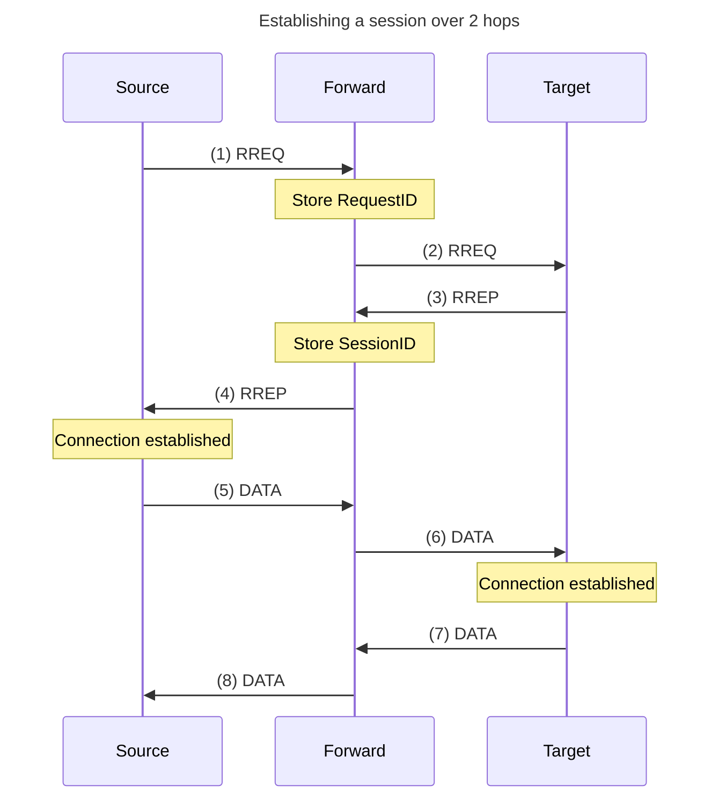
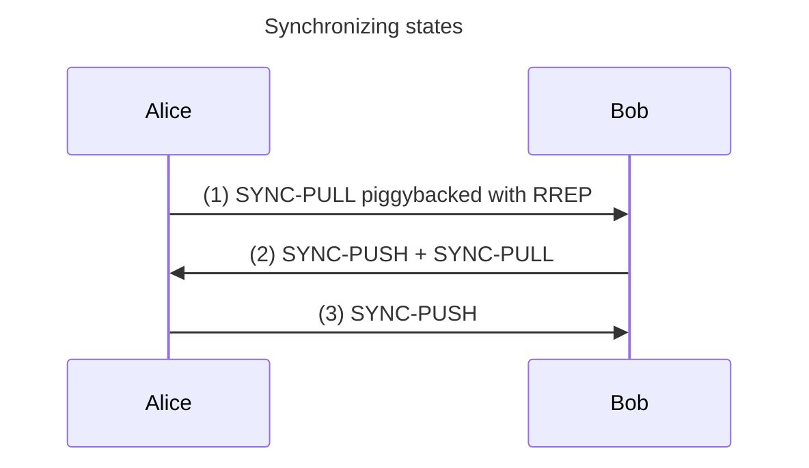

# Specification for the Starling protocol

- Abstract

## Introduction

- An open standard for anonymous ad-hoc routing

## Conformance

The key words "MUST", "MUST NOT", "REQUIRED", "SHALL", "SHALL
NOT", "SHOULD", "SHOULD NOT", "RECOMMENDED", "MAY", and
"OPTIONAL" in this document are to be interpreted as described in
[RFC 2119](https://www.rfc-editor.org/rfc/rfc2119).

## Definitions

- **User** A user on the network.
  TODO: Choose whether to use device or node
- **Device** The device running the protocol from the point of view of the user.
- **Peer** A peer is a point-to-point connection to the device.
- **Node** A host running the protocol on the network.
- **Endpoint Node** A node at either end of a (potentially multi-hop) communication.
- **Intermediate Node** A node that is helping facilitate the communication between two other endpoint nodes.
- **Link** Users can link their devices and become linked in order to communicate.
- **Link secret** A secret shared between two contacts used to encrypt their communication.
- **Group** A group is used to facilitate multicast communication between all members.
- **Group secret** A secret used for encryption in a group. Any user holding the group secret is a member of the corresponding group.
- **Session secret** A secret that is used for encrypting a single session.
- **Contact** a group or a link.
- **Contact secret** The corresponding link or group secret.

## Binary encoding

Packets are encoded following the structure described in the associated table.
Bytes are concatenated in the order they appear in the table from top to bottom.
Unsigned integers (uint) are encoded using big endian.

## Overview

This specification details a protocol stack for communication in Mobile Area Networks (MANET) using ad-hoc routing.

The protocol enables users to link, as a way to communicate with other users.
When two users want to link up with each other they establish a common link secret key, as detailed in [Linking](#linking).
After linking, the two users are able to send data to each other.
The process of sending data contains multiple steps, which will be demonstrated by the following example.

TODO: Remove following part? (And replace with "Session establishment overview")
User `A` wants to send a message to user `B`.
Initially `A` needs to find a route to `B` such that the message can be delivered.
This is handled by the network layer as described in [Network Layer](#network-layer).
What essentially happens is that `A` sends a packet containing a route request to its neighbors, which then continue spreading the request on the network.
If `B` is within the network, it will receive the route request and reply to it with a route reply.
Once `A` receives the reply, a route has been established, and `A` can send the data it wanted to send using a session packet.
Before `A` sends the data it will encrypt it using the secret key it shares with `B`, to ensure confidentiality.

While the network layer provides the basis for routing messages, reliability and message ordering is provided by the [Transport Layer](#transport-layer).
It attaches a sequence number to the messages in the data packets it sends, using the session packets from the network layer.
Thus, when `A` sends a message to `B`, `B` can identify if it is missing some earlier messages.
`B` also replies with an acknowledgement packet once it has received a message, which enables `A` to confirm the delivery.
If no acknowledgement is received, `A` will assume that `B` did not receive the message, and resend it...

Overview explanation based on examples.

- Link devices
- Send route request
- Receive route reply
- Encrypt and send data

### Session establishment overview

Before two contacts can [communicate](#session-communication), a session must first be established.



1. The forward node updates its routing table by storing the `RequestID` along with the `DeviceID` of the node it received the [`RREQ`](#rreq-route-request) from.

2. [`RREQ`](#rreq-route-request) has reached the target.
   The target will check the [contact bitmap](#contact-bitmaps) to see if they should reply to the request.
   If the bitmap matches, they will generate a new `SessionID` and respond with a [`RREP`](#rrep-route-reply).

3. [`RREP`](#rrep-route-reply) is received by a forwarding node.
   It updates the entry in the routing table with the new `SessionID` and the node it received it from.

4. The source gets the [`RREP`](#rrep-route-reply), and can verify that it was created by the target.
   It now sees the connection as established, and can start sending `SESS` to the target with the correct `SessionID`.

5. Once the [`SESS`](#sess-session-packet) packets arrive with the `SessionID`,
   the intermediary nodes can be sure that the [`RREP`](#rrep-route-reply) they saw before was valid (and not from a black-hole attack),
   and can thus trust the updates in its routing table, and use it in other contexts.
   It of course also forwards the [`SESS`](#sess-session-packet) according to its routing table.

6. [`SESS`](#sess-session-packet) packet reaches the target, and thus it also sees the connection as established.

## Cryptographic primitives

The protocol uses the following cryptographic primitives.

- `AES-GCM`: Is used for all symmetric encryption. Specified in [RFC 5288](https://www.rfc-editor.org/rfc/rfc5288).
- `X25519 ECDH`: Is used for key agreement when linking. Specified in [RFC 7748, section 6.1](https://www.rfc-editor.org/rfc/rfc7748.html#section-6.1).
- `Ed25519`: Is used for public key authentication. Specified in [RFC 8032](https://www.rfc-editor.org/rfc/rfc8032).
- `HKDF`: Is used for key derivation. Specified in [RFC 5869](https://www.rfc-editor.org/rfc/rfc5869).
- `HMAC`: Is used to find indices when encoding contact bitmaps. Specified in [RFC 2104](https://www.rfc-editor.org/rfc/rfc2104)

## Architecture

Explain the layers

### Link layer

Assumptions for the link layer:

- Bidirectional communication
- Unreliable
- Point to point (multicast is not required)
- Does not need to have: authentication, integrity, confidentiality.

The link layer can potentially be implemented on top of any communication technology,
as long as it facilitates bidirectional, point to point communication.

#### Bluetooth Low Energy

The implementation MAY chose to use Bluetooth Low Energy to facilitate as the link layer.

Bluetooth Low Energy introduces two kinds of actors,
a central and a peripheral.
The peripheral advertises itself and the central can scan and connect to it.
When a connection has been established they can communicate with each other through the use of notifications.

When the device is connected to the network, it MUST run both a central and a peripheral, in order to both connect to other devices and to let other devices connect to it.

The peripheral MUST advertise a service with a characteristic with the following settings:

Service UUID: `e3c9f0b1-a11c-eb0b-9a03-d67aa080abbc`

Characteristic UUID: `68012794-b043-476c-a002-650191132eef`

Characteristic properties:

- Permit notifications
- Write without response
- Readable and writable permissions

The central SHOULD scan for other peripherals with the same service and characteristic UUIDs and connect to it when a match is found.

When the central connects to a peripheral it MUST request to enable notifications for the connection.
It is also RECOMMENDED that a higher MTU is negotiated.

When notifications has been enabled, the central can send data to the peripheral by writing to its characteristic.

The peripheral can send data to the central by updating the value of its central only for that central.
Since notifications has been enabled, this will let the central know of the data immediately.

### Packet layer

When using the link layer, packets must fit in blocks of some maximum size (MTU) defined by the link layer.
To handle this, the packet layer splits up the data to be transmitted into multiple packet layer packets.

| Name         | Type           | Description                                                   |
| ------------ | -------------- | ------------------------------------------------------------- |
| Non-empty    | 1 bit          | Indicates whether or not this packet contains data            |
| Continuation | 1 bit          | Indicates whether or not this packet is a continuation packet |
| Length       | 14 bit         | The length (in bytes) of the `Data` field                     |
| Data         | `Length` bytes | The data to be transmitted                                    |

Table: Format of a packet layer packet.

The `Non-empty` field is 1 if the packet contains data and 0 otherwise.
The `Continuation` field indicates whether the data contained in this packet is the end of the data,
or if the data continues in another packet (1 indicates continuation, and 0 indicates end of data).
The `Length` field specifies the length of the data contained in this packet, in bytes.
The `Data` field is the actual data to be transmitted.

### Network layer

#### Request and session tables

| Name       | Type   | Description                            |
| ---------- | ------ | -------------------------------------- |
| Request ID | 8 byte | The ID of the route request            |
| Source     | MAC    | The MAC address of the source neighbor |

Table: An entry in the Request table.

| Name       | Type   | Description                            |
| ---------- | ------ | -------------------------------------- |
| Session ID | 8 byte | The ID of the session                  |
| Request ID | 8 byte | The ID of the initial route request    |
| Source     | MAC    | The MAC address of the source neighbor |
| Target     | MAC    | The MAC address of the target neighbor |

Table: An entry in the Session table.

The request and session tables are used to maintain the local state required to properly route packets.
For the session table, intermediate nodes will have both the `Source` and `Target` field,
whereas the nodes at each end of the routes will leaves one of these fields empty.

#### `RREQ`: Route request

Implementations MUST handle this packet.

| Name                               | Type        | Description                                         |
| ---------------------------------- | ----------- | --------------------------------------------------- |
| Packet type                        | 1 byte      | The value `0x01`                                    |
| Request ID                         | 8 byte      | A random ID used to identify the request            |
| TTL                                | 16 bit uint | The max number of hops before the packet is dropped |
| Ephemeral key                      | 32 bytes    | ECDH Public key used for session key derivation     |
| [Contact bitmap](#contact-bitmaps) | 256 bytes   | A bitmap encoding the targeted contacts             |

Table: Format of a route request packet.

A node constructs and sends a `RREQ` when they want to communicate with one or multiple contacts.
The node should store the newly generated `Ephemeral key` along with the `Request ID`.
The contact(s) are encoded in the `Contact bitmap` as seen in [creating a contact bitmap](#creating-a-contact-bitmap).

When a `RREQ` is received it MUST be discarded if the `Request ID` already is contained in the request table.
If the `Request ID`is not in the request table, its `Source` and `Request ID` SHOULD be added to the `Request table`.
Following this, the contact bitmap SHOULD be matched against each contact of the device (see [matching contact bitmaps](#matching-a-contact-against-a-bitmap)).
If no contact matches, the `RREQ` SHOULD be forwarded by decrementing its `TTL` field by 1, and if the `TTL` is non-zero sending the modified packet to its neighbors.
If instead one or more contacts match, an entry SHOULD be created in the session table for each contact, wherein the `Target` field is left empty (this indicates that the node is an endpoint).
An appropriate [`RREP`](#rrep-route-reply) SHOULD also be sent for each matched contact (see [`RREP`](#rrep-route-reply)), to the node the `RREQ` was received from.

TODO: Mention that `TTL` should technically be restricted in size. (Maybe in separate "Security Considerations" chapter)

#### `RREP`: Route reply

Implementations MUST handle this packet

| Name          | Type                 | Description                                                |
| ------------- | -------------------- | ---------------------------------------------------------- |
| Packet type   | 1 byte               | The value `0x02`                                           |
| Request ID    | 8 byte               | The ID used to identify the route request                  |
| Session ID    | 8 byte               | A random ID used to identify the new session               |
| Ephemeral key | 32 bytes             | ECDH Public key used for session key derivation            |
| Nonce         | 12 bytes             | Random nonce used as IV for AES-GCM                        |
| Payload size  | 32 bit uint          | The size in bytes of piggybacked data, 0 specifies no data |
| Payload       | `Payload size` bytes | Encrypted application data to be piggybacked               |
| Tag           | 16 bytes             | Authentication tag produced by AES-GCM                     |

Table: Format of a route reply packet.

A `RREP` SHOULD be issued when the contact bitmap of a [`RREQ`](#rreq-route-request) finds a match.
The `Request ID` of the [`RREQ`](#rreq-route-request) MUST be copied to the `RREP` and a new `Session ID` is generated randomly.
TODO: Describe `Ephemeral key`?

The `RREP` MAY include a `Payload` with [`Application layer`](#application-layer) data if relevant.
If no `Payload` data is contained, the `Payload size` must be 0.
The `RREP` MUST use `AES-GCM` to encrypt the `Payload` (if present) and to sign the packet.
Everything up to the `Nonce`, is used as the `info` argument when sealing.

If a `RREP` with a `Request ID` not in the request table is received, the packet MUST be ignored.
Otherwise, when a `RREP` packet is received, if the `Source` field in the session table is not nil, the node is seen as an intermediate node in relation to the session else the node is seen as an endpoint.
If the node is an intermediate node, a new entry is added to the session table copying the `Session ID`, `Request ID` and `Target` address from the `RREP`, and setting the `Source` field to the value of `Source` field from the corresponding route table entry identified by the `Request ID`.
The node then forwards the `RREP` to the `Source` node.
If the node is an endpoint it similarly create an entry in the session table except it leaves the `Source` field empty, and can now consider the session established.
It SHOULD also compute the `Session secret` (see [Session secret](session-secret)), and store this along with the `Session ID`. (TODO: As well as the contact?)

#### `SESS`: Session packet

Implementations MUST handle this packet.
See [session communication](#session-communication) for more.

| Name        | Type         | Description                            |
| ----------- | ------------ | -------------------------------------- |
| Packet type | 1 byte       | The value `0x03`                       |
| Session ID  | 8 byte       | The ID of the session                  |
| Nonce       | 12 bytes     | Random nonce used as IV for AES-GCM    |
| Size        | 32 bit uint  | The size of the succeeding data block  |
| Data        | `Size` bytes | Data encrypted by AES-GCM              |
| Tag         | 16 bytes     | Authentication tag produced by AES-GCM |

Table: Format of a session packet.

A `SESS` packet is sent when a node wants to send data over a session.
The `SESS` packet MUST use `AES-GCM` to encrypt the `Data` field and to sign the packet using the `Session secret`.
Everything up to the `Nonce`, is used as the `info` argument when sealing.

If a `SESS` packet is received and the sender is neither the `Source` or the `Target`, the packet MUST be ignored.
If the `Session ID` of the `SESS` packet is not contained in the session table, the packet MUST be ignored.
Otherwise if the receiving node is an intermediate node the packet SHOULD be forwarded to the `Target` node in the session table entry for this session.
In the case that the receiving node is an endpoint, is should decrypt the `Data` field using the `Session secret` associated with the `Session ID`, and deliver the resulting data to an upper layer.

#### `RERR`: Route error

Implementations SHOULD handle this packet.

| Name        | Type   | Description           |
| ----------- | ------ | --------------------- |
| Packet type | 1 byte | The value `0x04`      |
| Session ID  | 8 byte | The ID of the session |

Table: Format of a route error packet.

When a valid `RERR` is received containing a `Session ID` known to this device from the correct neighbor,
the session SHOULD be removed from the local session table such that future packets on this session will be ignored.
If the receiving node is an intermediate node, a `RERR` SHOULD also be forwarded to the relevant `Source` or `Target` node from the session table entry.

A new `RREQ` MAY be broadcast in an attempt to establish a new session.

#### Session secret

TODO: Describe how to compute the session secret

### Transport layer

The transport layer is responsible for sending data reliably over the sessions maintained by the network layer.
It ensures FIFO ordering of packages and adds reliability of packet delivery within a session.

#### `DATA`: Data packet

Implementations MUST handle this packet.
See [session communication](#session-communication) for more.

| Name            | Type            | Description                       |
| --------------- | --------------- | --------------------------------- |
| Packet type     | 1 byte          | The value `0x01`                  |
| Sequence number | 4 bytes         | The sequence number of the packet |
| Data            | Remaining bytes | Data from the application layer   |

Table: Format of a data packet.

If a `DATA` packet is received with a `Sequence number` that it has seen before,
the packet SHOULD be ignored.
If a `DATA` packet is received with a `Sequence number` greater than one more than the last delivered `DATA` packet,
it should be buffered until all earlier packets have been delivered first.
If the `Sequence number` is exactly one greater than the last delivered packet, this packet can be delivered immediately.
Delivering a packet can cause other packets that are currently buffered to also be delivered,
as long as their `Sequence number` is exactly one larger than the last one delivered.

When sending a `DATA` packet, the `Sequence number` MUST take the value one larger than the previously sent `DATA` packet by that device.
The first `DATA` packet to be send on a session by a device MUST have a `Sequence number` of 1.

#### `ACK`: Acknowledge packet

Implementations MUST handle this packet.
See [session communication](#session-communication) for more.

| Name               | Type             | Description                          |
| ------------------ | ---------------- | ------------------------------------ |
| Packet type        | 1 byte           | The value `0x02`                     |
| Latest seq. num.   | 4 bytes          | The `Sequence number` of the packets |
| Count              | 32 bit uint      | The number of missing packets        |
| Missing seq. nums. | Count \* 4 bytes | A list of missing seq. nums.         |

Table: Format of an acknowledge packet.

When receiving an `ACK` packet, the node SHOULD attempt to resend the packets with the associated sequence numbers listed in `Missing seq. nums.`.
All of the packets up to `Latest seq. num.` not listed in `Missing seq. nums.` can be reported as delivered.

An `ACK` packet MUST be sent back after at most 1 second from receiving a `DATA` packet.
However, a single `ACK` packet can be used to acknowledge many `DATA` packet potentially received within that second.
The `Latest seq. num.`represents the highest sequence number this node has seen.
The list of `Missing seq. nums.` contains all of the sequence numbers less than `Latest seq. num.` that this node has not seen yet.

#### Session timeouts

If an `ACK` packet has not be received after `t_SESS` seconds from sending a `DATA` packet, the underlying session SHOULD be considered to be timed out.
The variable `t_SESS` is left as a choice of the implementation but MUST be at least one second.
It is RECOMMENDED that is is at least the expected round trip time + one second.

### Application layer

The application layer consists of all the encrypted data sent across a session using transport layer DATA packets.

The first byte is reserved as an indication of how to interpret the rest of the packet.

| Byte | Description                                                     |
| ---- | --------------------------------------------------------------- |
| 0x01 | Application specific packet                                     |
| 0x02 | [Synchronization extension](#extension-message-synchronization) |

Values above 0x02 are open to be used for further extensions of the protocol.

An application specific packet `0x01` indicates that the format of the packet lies outside the scope of this specification.
And it is thus up to the implementation to identify and handle the packet properly.

## Linking

The purpose when linking devices is to establish a common contact secret between the two users.
This is done in an out-of-band session using X25519 ECDH.

1. Alice generates an ephemeral ECDH key-pair $a_p\ /\ a_s$. She shares her public key $(a_p)$ with Bob over the out-of-band session.

2. Bob generates his own ephemeral ECDH key-pair $b_p\ /\ b_s$. He then shares his public key $(b_p)$ with Alice over the out-of-band session.

3. Both Alice and Bob compute the shared secret using ECDH.

The implementation MUST ensure the following properties of the out-of-band session hold.

- Authentication
- Integrity

### Using QR codes for linking

The implementation MAY choose to use QR codes to share the public keys in the linking process.
By REQUIRING the users to physically scan a QR code on the others device, authentication and integrity is obtained.

1. Alice starts a new short lived session by generating and encoding her public key in a QR code and shows it on her device.

2. Bob starts his own short lived session by scanning her public key with his device.

3. Bob then generates his key-pair and performs ECDH to get the shared link secret.

4. Bob now encodes his generated public key in a QR code and shows it on his device.

5. Alice scans his QR code with her device and performs ECDH to also obtain the shared link secret.
   She then terminates her session and forgets her original key-pair.

6. When Alice has scanned the QR code from Bob's device.
   Bob SHOULD perform an action to terminate his session. Eg. by pressing a "Done" button on his device.

Since it is possible for Bob to obtain the link secret before Alice has the chance to do the same,
it is RECOMMENDED to make Bob aware of this until he has properly received and verified a [`SESS`](#sess-session-packet) packet from Alice.

### Group linking

Users can create new groups like such.
The device creates a new random 256 bit group secret $s$.
The secret $s$ can then be shared securely with pre-linked contacts.
Now $s$ can be encoded in [`RREQs`](#rreq-route-request) and multiple devices can reply targeting $s$.

## Contact bitmaps

The contact bitmap field in a [route request](#rreq-route-request) is used to encode multiple contact that are the intended receivers into a single route request.

The contact bitmap uses the `Request ID` from the [`RREQ`](#rreq-route-request) packet as the seed.

A contact bitmap is 256 bytes (2048 bits) long.

<!-- TODO: Check the code in the following two subsections -->

### Creating a contact bitmap (Encoding)

A contact bitmap MAY be constructed in the following way.

```python
seed = rreq.requestID
bitmap = 256 empty bytes

for c in contacts: # Outer loop
  hash = SHA256_HMAC(seed, c.secret)

  contact_bits = []
  for j in range(12):
    index = ((hash[j*2] & 0x07) << 8) | hash[j*2+1]
    while index in contact_bits:
      index = index + 1
    contact_bits.append(index)

  for j in range(12):
    # convert 2 bytes of hash to bitmap index
    index = contact_bits[j]

    # check for conflicts
    if index already set in bitmap and the value is different from (j % 2):
      continue Outer loop

  for j in range(12):
    index = contact_bits[j]

    # set bit at index in bitmap to j % 2
    set_bit(bitmap, index, j % 2)

set remaining bits in bitmap to be cryptographically random
```

### Matching a contact against a bitmap (Decoding)

A list of matched contacts MAY be computed in the following way.

```python
seed = rreq.requestID
bitmap = rreq.bitmap

matched_contacts = []

for c in contacts:
  hash = SHA256_HMAC(seed, c.secret)

  contact_bits = []
  for j in range(12):
    index = ((hash[j*2] & 0x07) << 8) | hash[j*2+1]
    while index in contact_bits:
      index = index + 1
    contact_bits.append(index)

  contact_match = True
  for j in range(12):
    # convert 2 bytes of hash to bitmap index
    index = contact_bits[j]
    value = j % 2

    if bitmap[index] != value:
      contact_match = False
      break

  if contact_match:
    matched_contacts.append(c)
```

## Session communication

After a session has been established, the two contacts can begin to send data back and forth.
This is done using [`DATA`](#data-data-packet) packets.
A message is stored in the `Data` attribute of the [`DATA`](#data-data-packet) packet along with the next `Sequence number`.

Each [`DATA`](#data-data-packet) packet sent over a session includes an incrementing `Sequence number`.
The first packet has a `Sequence number` of 0, and it is incremented by 1 for each new packet.

Upon receiving a [`DATA`](#data-data-packet) packet, the receiver MUST respond with an [`ACK`](#ack-acknowledge-packet) packet within 1 second.
If multiple [`DATA`](#data-data-packet) packets are received within this time span, a combined [`ACK`](#ack-acknowledge-packet) can be sent.
The [`ACK`](#ack-acknowledge-packet) packet contains the latest `Sequence number` the receiver has seen,
as well as a list of `Sequence numbers` smaller than the latest that the receiver has not seen.

## Extension: Message synchronization

Implementations MAY handle this extension as a way to synchronize messages between contacts.

### `SYNC-PULL`: Synchronization pull packet

| Name              | Type                       | Description                                |
| ----------------- | -------------------------- | ------------------------------------------ |
| Packet type       | 1 byte                     | The value `0x01`                           |
| Sender public key | 32 bytes                   | The public key of the sender (us)          |
| Sender version    | 4 byte                     | The latest version number of the sender    |
| Digest count      | 32 bit uint                | The number of encoded digests              |
| Digests           | `Digest count` \* 12 bytes | List of digests encoded as described below |
| Sender signature  | 64 bytes                   | Packet signature signed by the sender      |

Table: Encoding of a `SYNC-PULL` packet.

| Name       | Type        | Description                           |
| ---------- | ----------- | ------------------------------------- |
| Public Key | 32 bytes    | The public key of the node            |
| Version    | 32 bit uint | The latest version number of the node |

Table: Encoding of a digest within a `SYNC-PULL` packet.

### `SYNC-PUSH`: Synchronization push packet

| Name                | Type                         | Description                               |
| ------------------- | ---------------------------- | ----------------------------------------- |
| Packet type         | 1 byte                       | The value `0x02`                          |
| Sender public key   | 32 bytes                     | The public key of the sender (us)         |
| Receiver public key | 32 bytes                     | The public key of the receiver (them)     |
| Delta count         | 32 bit uint                  | The number of encoded deltas              |
| Deltas              | `Delta count` encoded deltas | List of deltas encoded as described below |
| Sender signature    | 64 bytes                     | Packet signature signed by the sender     |

Table: Encoding of a `SYNC-PUSH` packet.

| Name                 | Type                  | Description                           |
| -------------------- | --------------------- | ------------------------------------- |
| Public key           | 32 bytes              | The public key of the node            |
| Version              | 32 bit uint           | The latest version number of the node |
| Content length       | 32 bit uint           | The length of the included content    |
| Content              | Content length bytes  | The contents of the message           |
| Has group invitation | 1 byte                | 0x00 not attached, 0x01 attached      |
| Group invitation     | 32 bytes (or 0 bytes) | The shared secret for the group       |
| Signature            | 64 bytes              | Message signature                     |

Table: Encoding of a delta within a `SYNC-PUSH` packet.

### Maintaining local state

The synchronization layer maintains a local state of messages such that when two contacts synchronize they will converge towards a common state.

For each contact, a set of messages is maintained where each message holds:

- **Public key** a unique public key used to identify and sign all messages sent by the same device.
  Each device generates its own Ed25519 public/private key pair.
- **Version** the version number associated with the message
- **Content** arbitrary binary data representing the contents message.
- **Group attachment** an optional shared secret for another group
- **Signature** the signature of the message when encoded in a Delta.

### Adding a message

When sending a new message it is first added to the local state before it can be synchronized with the contact.
The version number of the message is set to be one more than the largest version number in the entire local state for the given contact.

The message can optionally include another group secret in order to invite this contact to the corresponding group.

A public key of the user is included in the message and will be used to identify the message sender.
Lastly the entire message is signed with the corresponding private key as described in the encoding of a delta section.

### Synchronizing states



1. When a session is established between two synchronizing contacts,
   the receiver of the [`RREQ`](#rreq-route-request) uses the payload attribute of the [`RREP`](#rrep-route-reply)
   to encode a list of digests in the form of a [`SYNC-PULL`](#sync-pull-synchronization-pull-packet) packet.

2. When the [`SYNC-PULL`](#sync-pull-synchronization-pull-packet) packet is received,
   the attached digest can be used to compute a sequence of deltas containing the messages that the other device has not received yet.
   The computed deltas are encoded in a [`SYNC-PUSH`](#sync-push-synchronization-push-packet) packet and sent back.
   Simultaneously a second [`SYNC-PULL`](#sync-pull-synchronization-pull-packet) packet is created and sent along to perform synchronization both ways.

3. The node now merges the deltas of the [`SYNC-PUSH`](#sync-push-synchronization-push-packet) packet into its local state.
   When the second [`SYNC-PULL`](#sync-pull-synchronization-pull-packet) packet arrives,
   a corresponding [`SYNC-PUSH`](#sync-push-synchronization-push-packet) packet is created and sent.
   When this packet is received and handled the synchronization process is complete.

### Digests

A digest is a set of all known `Public keys` in the local state together with the largest version number seen by any message from that respective node.
A digest can be encoded in a [`SYNC`](#sync-synchronization-packet) packet and is used to derive the deltas.

### Deltas

A delta encodes a single message that the other node does not have yet.
When synchronizing a sequence of deltas with all messages that the other node does not have yet is sent in order to reach identical local states.

An ordered sequence of deltas can be computed using a digest received from another node by a [`SYNC`](#sync-synchronization-packet) packet.
Now all messages with a version number larger than the version number associated with the `Public keys` in the digest will be included in the delta sequence.

It is important that deltas are ordered such that for any two deltas with the same `Public keys`, the one with the largest `Version` comes after the other one.
This ensures that if only a subset of the full delta sequence is received, the messages are still in order and deltas generated from future digests will include all missing messages.

### Authentication

When a node receives a [`SYNC-PULL`](#sync-pull-synchronization-pull-packet) packet, the signature of the packet MUST be verified using the senders public key.
Similar each delta encoded in a [`SYNC-PUSH`](#sync-push-synchronization-push-packet) packet MUST be also authenticated
by verifying its signature using the public key included within.

<!--
TODO: We want this to be a part of the specification.

Users can not verify the authenticity of the sender solely by the public key.
Therefore it is RECOMMENDED that implementations give the user a way to verify identities.
Eg. by validating the keys through an out-of-band connection.
-->
